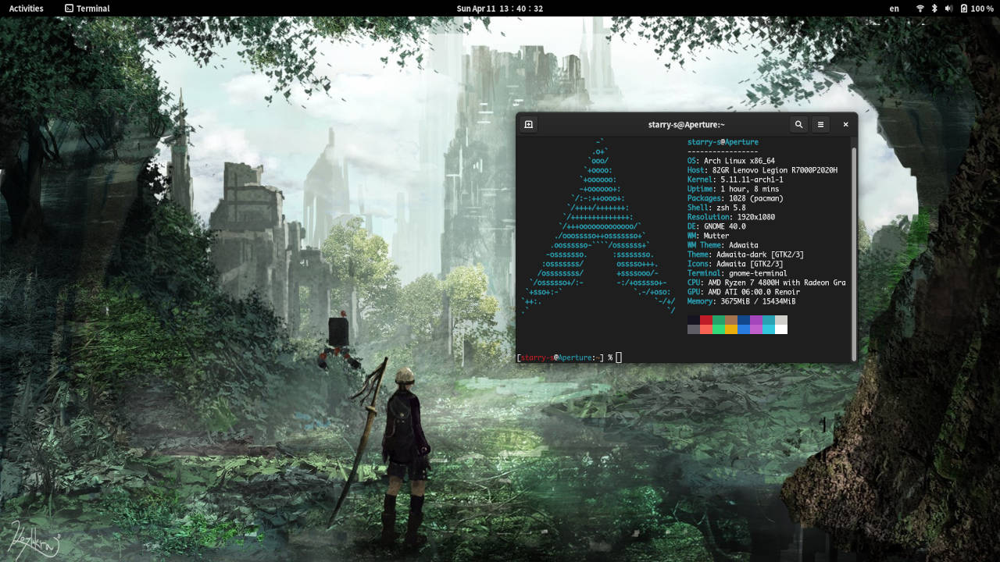

> 本篇原标题为「联想R7000P上手体验」，因为内容大多在讲安装Linux时遇到的问题及解决方法，所以把标题更改为「联想R7000P安装Arch Linux的常见问题」。

旧电脑坏掉了，因为坏的有些复杂而且不忍心拿到学校的修理店去修于是打算等到暑假有时间自己买零部件修。（就不吐槽惠普的产品设计问题了...

于是在网上逛了一会下决心再也不碰惠普了之后买了联想R7000P 2020，满血RTX 2060(这里指的是最大功耗为115W的笔记本显卡) + R7 4800H还是很香的，打守望屁股终于能稳定200+fps了。

所以隔了这么久我终于更新博客了。

<!--more-->

<!--aplayer
{
    "name": "Underground",
    "artist": "Lindsey Stirling",
    "theme": "#CC8888",
    "url": "https://music.starry-s.me/music/obj_wonDkMOGw6XDiTHCmMOi_2660462601_5de2_ff1b_7e9f_3314960c90b9d68875a3d640df5d283a.mp4",
    "cover": "https://music.starry-s.me/music/cover/109951164174520818.jpg"
}
-->

-------

# 安装Arch Linux

到手后就把之前买的西数SN750 1T固态换到了新电脑上，顺便格式化重装了个系统。

双M2插槽配上1T + 500G NVME，美汁汁。

于是直接给Linux分了150G root，16G SWAP，500G HOME（有点奢侈）， 然后还分了100G用来存steam游戏，剩下的全扔给Windows。

装Linux过程中只遇到了终端的警报声有些大而这个问题（插耳机时声音依旧从扬声器输出），别的问题都没遇到。

之前的电脑总是遇到奇葩问题，用旧版本Linux内核关机或者`lspci`时会卡死，显卡驱动装不好会导致开机死机，声卡驱动一直有问题听歌时音量大一点就爆音，HDMI接口直连的NVIDIA显卡所以显卡驱动没配置好独显不工作时没办法外接显示器(后来才知道type c接口有DP视频输出)。

新电脑买来装完系统后就遇到了一点小问题网上搜一下就解决了。

## 屏幕亮度不能调节

~~开个浏览器能把眼睛晃瞎~~

网上查了一下只有在bios设置为独显直连时解决亮度不能调节的方法，在混合显卡模式下，存在[AMD显卡亮度用16位值表示而不是8位值表示](https://bugzilla.opensuse.org/show_bug.cgi?id=1180749)的这个BUG (Feature?)所以没办法调节亮度。

所以`cat /sys/class/backlight/amdgpu_bl0/actual_brightness`得到的是一个大于255的数。

确保内核和显卡驱动都是最新的情况下，编辑内核参数`amdgpu.backlight=0`和`acpi_backlight=vendor`，可以解决混合模式下AMD显卡不能调节亮度这个问题。

如果你经常切换混合模式和显卡直连模式的话：

安装显卡驱动`xf86-video-amdgpu`和`nvidia`以及按需要安装nvidia的其他组件。

复制`/usr/share/X11/xorg.conf.d/10-nvidia-drm-outputclass.conf`到`/etc/X11/xorg.conf.d/`

编辑`/etc/X11/xorg.conf.d/10-nvidia-drm-outputclass.conf`在`EndSection`前添加一行参数允许nvidia驱动调节亮度。

```
Option "RegistryDwords" "EnableBrightnessControl=1"
```

之后编辑`/etc/modprobe.d/blacklist.conf`禁用闭源驱动`nouveau`和`ideapad_laptop`，让显卡驱动调节亮度。

```
# /etc/modprobe.d/blacklist.conf

blacklist nouveau
blacklist ideapad_laptop
```

编辑内核参数添加`acpi_backlight=vendor`和`amdgpu.backlight=0`。

以systemd-boot为例:

```
# /boot/loader/entries/arch.conf

options acpi_backlight=vendor
options amdgpu.backlight=0
```

最后重启电脑就能调亮度了。

## GDM不自启动

开机时GDM不会自动显示出来而是得手动切TTY2再切回TTY1才能显示。

查Wiki得知是因为GDM在显卡驱动被加载之前就启动了。

[参照Wiki](https://wiki.archlinux.org/index.php/GDM#Black_screen_on_AMD_or_Intel_GPUs_when_an_NVidia_(e)GPU_is_present)，设置[KMS早启动](https://wiki.archlinux.org/index.php/Kernel_mode_setting#Early_KMS_start)。

编辑`/etc/mkinitcpio.conf`

```
# /etc/mkinitcpio.conf

MODULES=(nvidia nvidia_modeset nvidia_uvm nvidia_drm amdgpu radeon)
```
如果你只使用独显直连模式的话可以去掉`amdgpu`和`radeon`。

然后`sudo mkinitcpio -p linux`重新生成内核镜像，之后重启。

这么做会使Wayland在开机时被禁用，所以在混合模式使用AMD显卡开机时无法使用Wayland，[参见Wiki](https://wiki.archlinux.org/index.php/GDM#GDM_ignores_Wayland_and_uses_X.Org_by_default)。

将`/usr/lib/udev/rules.d/61-gdm.rules`复制到`/etc/udev/rules.d/`，并编辑`61-gdm.rules`将下面这一行注释掉：

```
DRIVER=="nvidia", RUN+="/usr/lib/gdm-disable-wayland"
```

之后重启电脑再开机`echo $XDG_SESSION_TYPE`就可以检查现在使用的是`wayland`了。

## Optimus Manager

因为独显功耗太高了，使用独显直连模式在浏览网页写文档这类的轻度工作时电池待机只能2小时，用混合模式的话能待机4.5小时，外加上我也不打那些对性能要求很高的游戏，
所以日常使用时就在Bios里设置显卡为混合模式。

然后在Linux系统里安装`optimus-manager`，修改配置为：使用电池开机时关掉NVIDIA显卡，只让AMD集显工作；有外接电源时则使用“hybrid”混合模式，如果需要玩游戏的话用[nvidia-prime](https://wiki.archlinux.org/index.php/PRIME#PRIME_render_offload)让独显运行游戏。

Optimus Manager的配置方法和之前我[之前配置旧电脑时](/posts/archlinux-pavilion-gaming-laptop/)讲的基本一样，唯一区别就是这电脑是AMD，旧电脑是Intel。

所以编辑配置文件修改了这些地方：

```
# /etc/optimus-manager/optimus-manager.conf

# 设置开机自动切换显卡模式
startup_mode=auto

# 使用电池时关掉独立显卡降低功耗
startup_auto_battery_mode=integrated

# 使用外接电源时为混合模式
startup_auto_extpower_mode=hybrid

[amd]
# 因为安装的xf86-video-amdgpu, 所以修改驱动改为amdgpu
driver=amdgpu

```

安装好`nvidia-prime`后在混合显卡模式（hybrid）下，使用`prime-run`让独显运行游戏。

如果想让Steam以独显运行游戏，修改启动参数为`prime-run %command%`。

# Windows

在Windows系统下显卡独连时字体渲染有些蹦，设置了ClearType之后还是没啥改善。

主要是Visual Studio 2019的字体渲染真的瞎眼，最后装了Text Sharp插件换了Jet Brains字体才看起来正常了一些。

最后在NVIDIA控制面板全局设置里把平滑处理全关了，字体的锯齿才消失。

貌似是因为NVIDIA把文本编辑器当游戏渲染了。

-----

# Others

 * 在Linux系统里会遇到按Fn+Esc键时FnLock的灯没有亮这个问题，不过不影响FnLock的正常使用，所以就忽视了。

 * 如果要用诱骗线充电的话，用optimus-manager把独显关掉（用`nvidia-smi`得知独显在不使用的情况下仍有5W的功耗），然后装一个CPU功率调节的软件，例如`cpupower-gui`<sup>AUR</sup>，设置为节电模式，实测用小米65W GaN充电器给电脑充电，轻度使用没有卡顿掉电的情况。

 * 因为之前趁着狗东打折加上买显示器送的100E卡，只花了两百多买了一个紫米20移动电源（~~板砖~~），25000毫安且支持100WPD充电。按照上面讲的方法在电池满电的情况下一边轻度使用电脑一边充电，充电宝能用4小时左右，然后笔记本的电池还能续航4至5小时。（实在是因为原装充电器它太沉了）

 * 目前来看觉得这电脑还是蛮香的，AMD的CPU性能很强而且比intel版的Y7000P便宜一千块钱。尽管现在已经有二线厂商做AMD 5800系的笔记本了但是4800H的性能依旧够用，RTX3060显卡就当它是空气吧就算发售也是残血而且抢不到。

 * 然后就是电脑没有雷电3接口，只有一个支持USB3.2 Gen1的type c接口且支持DP1.2视频输出，不过USB接口倒是挺多的，电脑用到现在没有遇到啥AMD CPU引起的兼容性问题。

------


